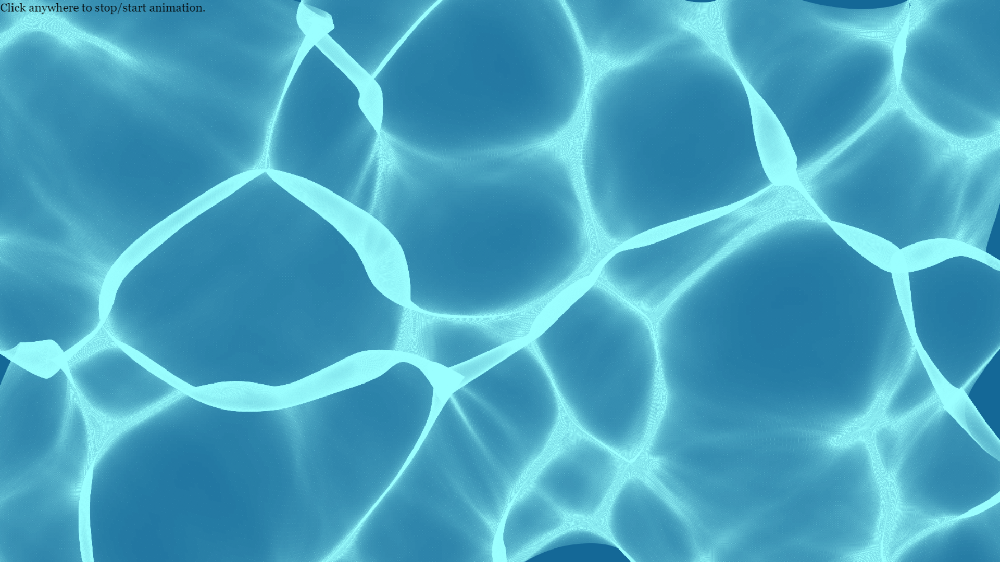

# Pool animation using caustics

Simulates a swimming pool with [waves](https://en.wikipedia.org/wiki/Wave_equation), [refraction](https://en.wikipedia.org/wiki/Refraction) and [caustics](https://en.wikipedia.org/wiki/Caustic_(optics)). 

/// For each grid square representing an incoming patch of light, refract the four corner coordinates onto
/// the bottom surface of the pool and draw that quadrilateral with an alpha inversely proportional to area 
/// (representing dispertion of the energy).

Uses [Fable](https://fable.io/) for F# to JS conversion.

[Try it now.](https://terryspitz.github.io/Pool/public/index.html)

## Build Requirements

* [dotnet SDK](https://www.microsoft.com/net/download/core) 3.0 or higher
* [node.js](https://nodejs.org) with [npm](https://www.npmjs.com/)
* An F# editor like Visual Studio, Visual Studio Code with [Ionide](http://ionide.io/) or [JetBrains Rider](https://www.jetbrains.com/rider/).

## Building and running the app yourself

* Install JS dependencies: `npm install`
* Install F# dependencies: `npm start`
* After the first compilation is finished, in your browser open: http://localhost:8081/

Any modification you do to the F# code will be reflected in the web page after saving.
