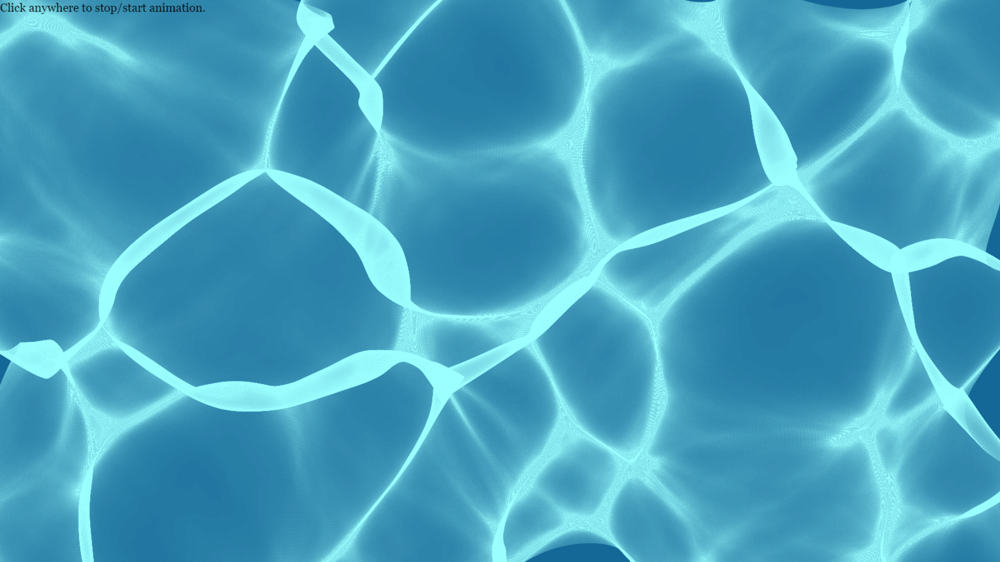

# Pool animation using caustics

Simulates a swimming pool with [waves](https://en.wikipedia.org/wiki/Wave_equation), [refraction](https://en.wikipedia.org/wiki/Refraction) and [caustics](https://en.wikipedia.org/wiki/Caustic_(optics)). 

/// For each grid square representing an incoming patch of light, refract the four corner coordinates onto
/// the bottom surface of the pool and draw that quadrilateral with an alpha inversely proportional to area 
/// (representing dispertion of the energy).

Uses [Fable](https://fable.io/) for F# to JS conversion.

[Try it now.](https://terryspitz.github.io/Pool/public/index.html)

## Renderers

The page picks a renderer at startup and shows fps and frame time in the corner.
Append a query string to override:

| URL | renderer |
| --- | --- |
| (default) | WebGL2 shader, falling back to the 2D canvas if unavailable |
| `?mode=canvas` | 2D canvas |
| `?mode=svg` | SVG, mapping the pool floor back to screen coordinates |
| `?res=4` | pixels per grid cell; smaller is finer and slower |

## Performance

### Separable wave evaluation (~40x fewer operations)

The surface is a sum of `(2f+1)^2 = 361` cosines. Evaluating that per pixel column
dominated every frame. The phase splits into an x-only and a `(y,t)`-only part:

    theta = (x + sgn(i)*speed*t)*i + (y + sgn(j)*speed*t)*j + phase
          = i*x + (j*y + phase + (|i|+|j|)*speed*t)      since sgn(i)*i = |i|

so `cos(theta)` expands by the angle-addition rule and the whole j-sum hoists out
of the column loop. `cos(pi*i*x)` then only depends on the grid, so it is
tabulated once per canvas size rather than per row. Per row the cost drops from
`columns * 361` transcendentals to `361` for the row plus `columns * 9`
multiply-adds.

This uses the real cosine rather than the `fastCos` parabola approximation, which
is both faster in this form and about 5% more accurate — that is the only change
to the image. `bench/derivs-bench.js` checks the rewrite against the same loop
evaluated with `cos` (agreement to 1.6e-15) and times both:

    grid 192x108 (res=10), 202 columns/row
      original   107.6 ms
      separable    2.6 ms   (41.8x faster)

### Other CPU work

* the wave table was a 2D wrapper whose indexer took a tuple, allocating one
  tuple per read — hundreds per pixel. It is now two flat arrays.
* the two derivative rows are swapped rather than copied (the copy also wrote one
  element past the end of the array).
* fully transparent quads are skipped instead of being filled.
* `printfn` ran on every frame; stats are now accumulated and shown twice a second.

### Grid margin

The grid is extended past the screen so that refracted quads from off screen
still cover the edges. That margin was a fixed 5 cells, which is only about right
at `res=30`; at finer resolutions uncovered wedges appear at the edges. It is now
sized in world units, at 4 standard deviations of the refraction offset, and
converted to cells.

### 2D canvas, before and after

`bench/browser-bench.js` drives the renderers in headless Chromium at 1280x720:

    res=10  before: nested loops, 5-cell margin        61.1 ms
    res=10  after:  separable derivs, sized margin     12.1 ms
    res=10     of which derivatives only                2.5 ms
    res=30  before: nested loops, 5-cell margin        10.8 ms
    res=30  after:  separable derivs, sized margin      1.9 ms

Note what is left: with the maths fixed, the 2D renderer is almost entirely
`ctx.fill()` — around 10 of those 12 ms. Batching the quads into one path per
colour bucket to cut ~20000 fill calls down to 101 was tried and is *much* worse
(336 ms): Skia pays more to resolve one path with thousands of subpaths than for
the same number of small independent fills. That measurement is kept in the
bench; the code is not.

### GPU

Being fill-bound is what motivates `src/Gpu.fs`. The CPU renderer is already a
mesh draw in disguise, so the same grid goes to the GPU as one indexed triangle
draw and the vertex shader does the refraction:

* vertex positions come from `gl_VertexID`, so the index buffer is the only
  geometry uploaded, and only when the canvas is resized.
* the 360 waves are an Nx1 `RGBA32F` texture holding `(i, j, amplitude, phase)`.
* patch area is analytic. The displacement is a sum of cosines, so its Jacobian
  is a sum of sines of the same arguments and costs nothing extra; the area ratio
  is `|det(I + J)|`, the continuum limit of the cross-product area the CPU
  version measures. Alpha is therefore per vertex and interpolates across each
  cell, dropping the quantisation into 101 colour steps and the seams between
  neighbouring quads.
* `speed*time` is reduced mod 2 before being passed in. `|i|+|j|` is an integer
  and the phase has period 2, so this is exact, and it keeps the shader argument
  small enough that a float stays accurate however long the animation runs.

The bench compiles the shaders taken verbatim out of `src/Gpu.fs`, draws with
them and reads back pixels, so they are checked on every run. The container has
no GPU, so those frame times are SwiftShader and not representative.

Next step if more speed is wanted: the separable trick applies on the GPU too, as
a two-pass render — one pass to a float texture of row coefficients, then 9
iterations per vertex instead of 360.

### Running the benchmarks

    npm install
    npm run bench        # derivative rewrite: accuracy and speed, in node
    npm run bench-web    # 2D canvas and WebGL, in headless Chromium

## Build Requirements

* [dotnet SDK](https://www.microsoft.com/net/download/core) 3.0 or higher
* [node.js](https://nodejs.org) with [npm](https://www.npmjs.com/)
* An F# editor like Visual Studio, Visual Studio Code with [Ionide](http://ionide.io/) or [JetBrains Rider](https://www.jetbrains.com/rider/).

## Building and running the app yourself

* Install JS dependencies: `npm install`
* Install F# dependencies: `npm start`
* After the first compilation is finished, in your browser open: http://localhost:8081/

Any modification you do to the F# code will be reflected in the web page after saving.
